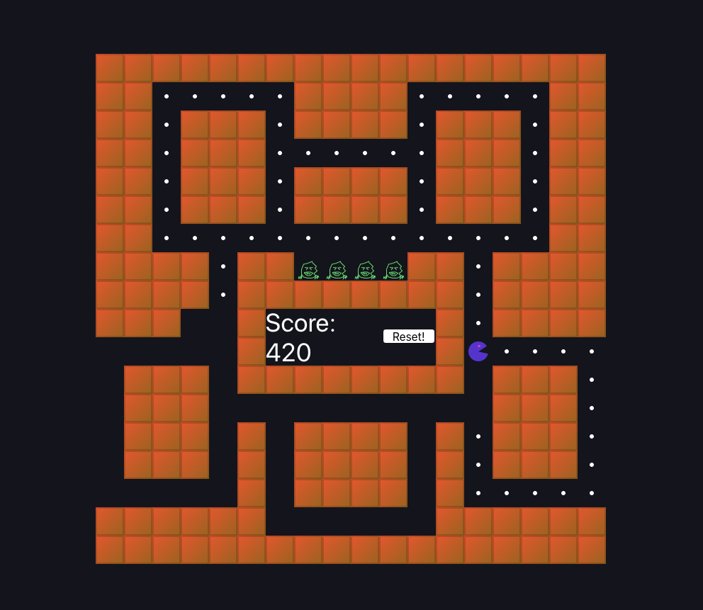

# dot-eater!

Still working on it! The player moves (only a little wonkily!) and collects dots, very exciting! Sorry it's not responsive at all, at the moment it all runs on a 720x720 pixel grid, lol. ~~Also the monsters don't move, and the win condition hasn't been written yet lol.~~ JK IT PLAYS! LINK: [LINK!](https://garethfield.com/dot-eater/)

